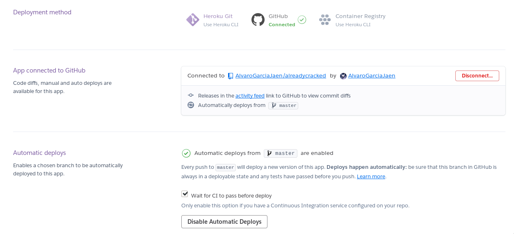

# alreadycracked

[](https://travis-ci.com/AlvaroGarciaJaen/alreadycracked)
[](https://circleci.com/gh/AlvaroGarciaJaen/alreadycracked)

## Índice
-   [Descripción](#descripción)
-   [Motivación](#motivación)
-   [Funcionalidad](#funcionalidad)
-   [Implementación](#implementación)
-   [Herramienta de construcción](#herramienta-de-construcción)
-   [Integración continua](#integración-continua)
-   [API REST](#api-rest)
-   [Despliegue PaaS](#despliegue-paas)

## Descripción
Se pretende desarrollar un microservicio que recoja hashes de diferentes
algoritmos (MD5, SHA1...) junto con su correspondiente en texto plano. El usuario
podrá tanto consultar un hash para obtener el texto plano, como añadir aquellas
correspondencias que no se encuentren. De esta manera se pretende que poco a
poco el conjunto de datos vaya creciendo.

Para hacer uso de este microservicio, se implementará un API REST también como
parte de este proyecto. Se espera así que cualquiera pueda desarrollar de manera
fácil y cómoda cualquier tipo de interfaz a partir de este trabajo.

## Motivación
Desde hace muchos años, [CrackStation](http://crackstation.net) ha sido el
referente en cuanto a base de datos de hashes a nivel mundial. No obstante,
cuando se desarrolló allá por 2010, se diseñó como una página web al uso. En
este proyecto, propongo desarrollar un microservicio que lleve a cabo la misma
funcionalidad que CrackStation pero aplicando las nuevas tecnologías que
actualmente funcionan tan bien. Una vez acabado su desarrollo (integración
continua, código, despligue...) el usuario podrá hacer consultas de una gran
variedad de funciones hash mediante un API REST. De esta manera, la comunidad
podrá crear diferentes aplicaciones finales (páginas web, aplicaciones móviles,
bots en redes sociales o aplicaciones de mensajería...) de la manera más cómoda
y fiable posible.

## Funcionalidad
El sistema deberá cumplir las siguientes funciones:
-   A partir de un texto plano, aplicar una función hash (MD5, SHA1...) y
    devolver el resultado.
-   A partir de un hash, detectar su tipo y devolver el texto plano que lo
    genera.

## Implementación
El lenguaje principal para este proyecto será [Ruby](https://www.ruby-lang.org).
Se ha elegido este lenguaje por ser open source, por las librerías que tiene y
que nos serán útiles para desarrollar este proyecto y por ser un lenguaje cómodo
y fácil a la hora de escribir y leer.
Para llevarlo a cabo, haremos uso de las siguientes librerías/herramientas:

-   [Sinatra](http://sinatrarb.com). Se trata de un microframework diseñado para
    crear aplicaciones web en Ruby con un mínimo esfuerzo. Podríamos considerar
    que Sinatra es el equivalente a [Flask](https://palletsprojects.com/p/flask/)
    en Ruby. Su sintaxis tan sencilla y la amplia documentación disponible hará
    que el consumo de datos mediante el API REST sea el menor de nuestros problemas.

-   [Digest](https://github.com/ruby/digest). Se trata de un framework que nos
    permitirá usar las diferentes funciones hash. Como se explicó más arriba,
    la función de este microservicio va más allá del simple almacenamiento de
    datos, también permitirá que la comunidad añada entradas nuevas, lo que requerirá
    su comprobación para asegurar la legitimidad de la misma.

-   [rbenv](https://github.com/rbenv/rbenv). Para el correcto desarrollo de un
    proyecto es necesario el uso de entornos virtuales. Esto nos permite no
    entrar en conflicto con el resto de proyectos que estemos llevando a cabo en
    nuestro ordenador y gestionar de manera correcta las versiones de las librerias
    usadas. Se ha decidido usar rbenv en contraposición a [RVM](https://github.com/rvm/rvm)
    por ser más apoyada por la comunidad, además de por ser más ligera (no
    necesitamos más).

-   [MongoDB](https://www.mongodb.com/). Necesitamos una base de datos que se
    adecúe a nuestro proyecto. Como necesitamos una base de datos que sea muy
    escalable debido a la gran cantidad de datos que vamos a almacenar y muy
    rápida para consultas simples, sí o sí debemos ir a por una base de datos
    NoSQL. Se ha elegido MongoDB por ser la más popular, lo que significa mayor 
    documentación en el caso de que nos encontremos algún problema

-   [Logstash](https://www.elastic.co/products/logstash). Necesitamos llevar un
    registro de eventos del microservicio. Debido a su popularidad y al stack al
    que pertenece ([Elastic](https://www.elastic.co/products/)), se ha elegido
    Logstash pensando a largo plazo por su fácil integración con el resto de 
    componentes del stack por si fuera necesario.

-   [Travis CI](https://travis-ci.org/). Para comprobar mediante tests que
    nuestro proyecto cumple los objetivos necesarios, usaremos Travis CI. Se
    elige por su popularidad y su fácil integración con GitHub.

## Herramienta de construcción
Al desarrollarse en Ruby, se ha elegido 
[Rakefile](https://github.com/AlvaroGarciaJaen/alreadycracked/blob/master/Rakefile)
como herramienta de construcción:
```ruby
require 'rake/testtask'

Rake::TestTask.new(:test) do |t|
  t.libs << "t"
  t.test_files = FileList['t/test*.rb']
  t.verbose = true
end

Rake::TestTask.new(:test_unit) do |t|
  t.libs << "t"
  t.test_files = FileList['t/test_unit.rb']
  t.verbose = true
end

Rake::TestTask.new(:test_func) do |t|
  t.libs << "t"
  t.test_files = FileList['t/test_func.rb']
  t.verbose = true
end

desc "Install gems"
task :install do
  sh 'bundle install'
end

desc "Initialize service"
task :init do
  sh 'god -c config.god'
end

desc "Run service"
task :start do
  sh 'god start alreadycracked'
end

desc "Stop service"
task :stop do
  sh "god stop alreadycracked"
end

desc "Deploy to Azure"
task :deploy_az do
  sh "bash scripts/az-deploy.sh"
end

desc "Purge from Azure"
task :purge_az do
  sh "bash scripts/az-purge.sh"
end

task :default => :init
```

Se llama con `rake` y se han definido las
siguientes tareas:
-   `rake init`: Inicia el gestor de tareas

Se está usando [god](http://godrb.com/) como gestor de tareas. Funciona con un
demonio que inicia y para procesos según tenemos definidos en nuestro
[config.god](https://github.com/AlvaroGarciaJaen/alreadycracked/blob/master/config.god).
Lo que hace es almacenar en un archivo _alreadycracked.pid_ el pid del programa
para saber luego como pararlo. Cuando inicializamos god, automáticamente lanza
la orden start.

-   `rake stop`: Para el servicio web

Le indica al gestor de tareas que pare nuestro servicio web. Para saber qué
proceso parar, mira el archivo que crea cada vez que inicia el proceso
(_alreadycracked.pid_).

-   `rake start`: Iniciar el servicio web

Cuando el gestor de tareas ya está inicializado, necesitamos otra orden para
iniciar únicamente el servicio (y no de nuevo el gestor de tareas).

-   `rake test`: Ejecuta todo los tests 

Se ejecutan tanto los tests unitarios como funcionales.

-   `rake test_unit`: Ejecuta todo los tests unitarios 

Se ejecutan únicamente los tests unitario para comprobar que la lógica de
nuestro servicio funciona correctamente.

-   `rake test_func`: Ejecuta todo los tests funcionales 

Se ejecutan únicamente los tests funcionales para comprobar que la API REST
funciona correctamente. 

-   `rake deploy_az`: Lanza el despliegue en el PaaS de Azure

Para hacerlo más sencillo, se da la posibilidad de llamar desde aquí
directamente al script que hace el despliegue completo en Azure.

-   `rake purge_az`: Deshace el despliegue en el PaaS de Azure

Igual que se hace el despliegue, también se puede volver atrás deshaciendo todo
lo creado.

Se ha decidido dar la posibilidad de ejecutar los tests por separado para
aprovechar el uso de las dos plataformas de CI.

## Integración continua
Para implementar una correcta integración continua debemos hacer un desarrollo
guiado por pruebas (TDD). Se han escrito tests para cubrir la
[funcionalidad](#funcionalidad) básica:
-   El hash que se devuelve ante un texto plano es el correcto.
-   Se detecta correctamente el tipo de hash.
-   El texto plano que se devuelve a partir de un hash es el correcto.

Para hacerlo, se ha usado el framework 
[test-unit](https://ruby-doc.org/stdlib-1.8.7/libdoc/test/unit/rdoc/Test/Unit.html) 
 y [rack-test](https://github.com/rack-test/rack-test) para probar la API REST
de manera nativa, interactuando con la clase directamente. 
Los tests pueden verse
[aquí](https://github.com/AlvaroGarciaJaen/alreadycracked/tree/master/t) 

Para automatizar la ejecución de tests se está utilizando [Travis
CI](https://travis-ci.com) y [CircleCI](https://circleci.com/):

### Travis CI
En primer lugar, se ha configurado Travis CI para lanzar los tests de manera
automática. Es uno de los sistemas de integración continua más conocidos, por lo
que tenemos muchos ejemplos sobre como realizar una correcta configuración.
[Nuestro archivo de
configuración](https://github.com/AlvaroGarciaJaen/alreadycracked/blob/master/.travis.yml) es muy sencillo:
```yaml
language: ruby
install: rake install
script: rake test_unit
```
Especificamos el lenguaje con la etiqueta 'language', con la etiqueta install
indicamos la orden con la que debe instalarse lo necesario para realizar los
tests. Como tenemos la tarea install en nuestro [Rakefile](#Herramienta-de-construcción),
 usaremos esto. Por último le decimos cómo ejecutar los tests.
Como vamos a utilizar dos plataformas para correr tests, lo que haremos será
dividirlos en dos partes. Por un lado correremos los tests unitarios (aquí),
y por otro los tests funcionales (CircleCI).
No hace falta especificar la versión, ya que comprueba directamente al archivo
[.ruby-version](https://github.com/AlvaroGarciaJaen/alreadycracked/blob/master/.ruby-version).

### CircleCI
En segundo lugar, se ha configurado CircleCI para lanzar los tests de manera
automática. Se ha elegido por, según la comunidad, ser uno de los más rápidos.
En el siguiente apartado se hablará más sobre eso. [Nuestro archivo de
configuración](https://github.com/AlvaroGarciaJaen/alreadycracked/blob/master/.circleci/config.yml)
también es bastante sencillo:
```yaml
version: 2
jobs:
  build:
    docker:
      - image: circleci/ruby:2.6.5

    steps:
      - checkout

      - run:
          name: Install gems
          command: rake install

      - run:
          name: Run tests
          command: rake test_func

      - run:
          name: Start web service
          command: rake start
```
Como podemos ver en el archivo de
configuración, CircleCI tiene un sistema basado en contenedores. En este caso le
decimos que use el de Ruby con la versión 2.6.5 de su propio repositorio. Una
vez con la imagen corriendo, ya puede lanzar comandos (_rake_ en este caso para
ejecutar los tests). Instalamos las gemas con `rake install`, ejecutamos los
tests funcionales con `rake test_func` y probamos a levantar el servicio con
`rake start`.

### Conclusiones
Los sistemas de integración continua me han parecido una herramienta muy útil,
ya no solo para hacer tests como hemos visto en este apartado sino también para
hacer el despliegue. A raiz de esto incluso he probado a hacer el despliegue
automático de gh-pages usando Travis. Aunque en el repositorio no pueden verse
las mejores prácticas, sí que muestra la potencia que puede llegar a tener esto
cuando se hace desarrollo ágil. El repositorio puede verse
[aquí](https://github.com/AlvaroGarciaJaen/alvarogarciajaen.github.io). 

Hablando ahora sobre los dos sistemas de integración que se han usado (Travis CI y
CircleCI), en mi opinión ambos son muy potentes pero cada uno tiene sus puntos
fuertes:
-   CircleCI es mucho más rápido que Travis. Tras probar ambos, CircleCI
    devuelve resultados en unos 5 segundos mientras que Travis llega al minuto
    casi. Algunos compañeros comentan que se debe a que mi proyecto no cuenta con
    dependencias y por eso es capaz CircleCI de hacerlo tan rápido. Conforme el
    proyecto vaya creciendo veremos como se adapta. No obstante, las VM de
    Travis tardan muchísimo en arrancar en comparación a su competidor. Quizás
    usando Docker también en Travis se mejorarían los resultados indicando un
    lenguaje _minimal_, pero esto no quita que la velocidad con la que CircleCI es
    capaz de arrancar una máquina no tiene ni punto de comparación.
-   Desde el principio, el archivo de configuración de Travis me parece mucho
    más sencillo de entender que el de CircleCI. Claro está, esto variará de una
    persona a otra. 
-   La interfaz de Travis parece mucho más robusta mientras que la de CircleCI
    me ha dado pequeños errores temporales, como ejecución del sistema con
    archivos de configuración desactualizados.

Obviamente, estas son impresiones personales que no tienen por qué coincidir con
todo el mundo.

Al final, tanto Travis, como Circle, como cualquier otra plataforma, lo único que
hacen es ejecutar un programa y
en función del código que devuelva, actuar en consecuencia. Cuando un programa
se ha ejecutado correctamente devuelve 0, si ha habido algún tipo de error
devuelve un número diferente a 0. Teniendo esto en mente, podemos ejecutar
cualquier cosa (como en el caso de Circle, que estamos levantando un servicio). En otras
palabras, los tests no son nada especial, sigue siendo un proceso que devuelve 0
si todos los tests se han ejecutado correctamente y otro código si ha habido
algún tipo de error.

## API REST
En este apartado veremos los diferentes endpoints de nuestra API REST para saber
como comunicarnos con ella:

### Información
-   Un usuario podrá consultar información general sobre las recursos disponibles de
    la API REST.

#### Recurso URL
-   `GET /`

#### Ejemplo
`curl http://localhost:9292/`
```json
{
  "status": "http://localhost:9292/status",
  "get_hash": "http://localhost:9292/hash/:type/:plain",
  "crack": "http://localhost:9292/crack/:hash"
}
```


### Obtener estado del API REST
-   Un usuario podrá consultar información sobre el estado actual de la API REST.

#### Recurso URL
-   `GET /status`

#### Ejemplo
`curl http://localhost:9292/status`
```json
{
  "status": "OK",
  "ejemplo": {
    "ruta": "/crack/fc5e038d38a57032085441e7fe7010b0",
    "valor": {
      "hash": "fc5e038d38a57032085441e7fe7010b0",
      "plain": "helloworld"
    }
  }
}
```

### Obtener hash a partir de un texto plano
-   Un usuario podrá obtener un hash aplicando una función a un texto plano.

#### Recurso URL
-   `GET /hash/:type/:plain`

#### Parámetros


| Nombre | Obligatorio | Descripción | Ejemplo |
|--------|-------------|-------------|---------|
| type | Sí | Tipo de hash que se quiere obtener, actualmente está MD5, SHA1 y SHA256 | md5 |
| plain | Sí | Texto plano al que se le quiere aplicar la función hash | helloworld |


#### Resultado
`curl http://localhost:9292/hash/md5/helloworld`
```json
{
  "type": "md5",
  "plain": "helloworld",
  "hash": "fc5e038d38a57032085441e7fe7010b0"
}
```

### Obtener y almacenar hash a partir de un texto plano
-   Un usuario podrá obtener un hash aplicando una función a un texto plano.
    Además, el par hash-texto plano se almacenará para aumentar la base de
    datos.

#### Recurso URL
-   `PUT /hash/:type/:plain`

#### Parámetros


| Nombre | Obligatorio | Descripción | Ejemplo |
|--------|-------------|-------------|---------|
| type | Sí | Tipo de hash que se quiere obtener, actualmente está MD5, SHA1 y SHA256 | md5 |
| plain | Sí | Texto plano al que se le quiere aplicar la función hash | helloworld |


#### Resultado
`curl -XPUT -H "Content-length: 0" http://localhost:9292/hash/md5/supersecret`
```json
{
  "type": "md5",
  "plain": "supersecret",
  "hash": "9a618248b64db62d15b300a07b00580b"
}
```

### Obtener texto plano a partir de un hash
-   Un usuario podrá obtener el texto plano a partir del cual puede obtenerse el
    hash dado.

#### Recurso URL
-   `GET /crack/:hash`

#### Parámetros


| Nombre | Obligatorio | Descripción | Ejemplo |
|--------|-------------|-------------|---------|
| hash | Sí | Hash que se busca | fc5e038d38a57032085441e7fe7010b0 |


#### Resultado
`curl http://localhost:9292/crack/fc5e038d38a57032085441e7fe7010b0`
```json
{
  "hash": "fc5e038d38a57032085441e7fe7010b0",
  "plain": "helloworld"
}
```

## Despliegue PaaS
Haremos el despliegue en Azure por los siguientes motivos:
-   Tiene versión gratuita (60 min/dia de cómputo)
-   Tiene una CLI que nos permite automatizarlo todo
-   Si somos estudiantes, tenemos 100€ para gastar y hacer pruebas

También haremos el despliegue en Heroku ya que:
-   Tiene versión gratuita (1 dyno gratuito)
-   También tiene una CLI que nos permite automatizarlo todo

El único problema es que Azure Webapp, en lo que a Ruby se refiere, solo soporta
Ruby on Rails por el momento y no Sinatra. Esto se puede solucionar fácilmente
haciendo un contenedor de Docker. Podemos ver la referencia a esto en la
documentación de Microsoft
[aquí](https://docs.microsoft.com/en-us/azure/app-service/containers/quickstart-ruby).

### Docker
A la hora de definir nuestra imagen de Docker, necesitamos crear nuestro
Dockerfile. Nos queda de la siguiente manera:
```Dockerfile
# Elegimos alpine como base para hacerlo lo más pequeño posible
FROM alpine:latest

# Creamos un directorio para la aplicación
RUN mkdir -p /app

# Establecemos el directorio como el espacio de trabajo
WORKDIR /app

# Copiamos el código fuente a la imagen
ADD lib ./lib

# Copiamos nuestro sample.json
ADD t/sample.json ./t/

# Actualizamos los paquetes ya instalados y los repositorios
RUN apk update && apk upgrade

# Instalamos los paquetes necesarios para correr la aplicación
RUN apk add ruby ruby-bundler ruby-dev build-base

# Borramos la cache de apk
RUN rm -rf /var/cache/apk/*

# Instalamos bundler para poder obtener las gemas de ruby directamente desde el
# Gemfile
RUN gem install --no-rdoc --no-ri bundler

# Copiamos el Gemfile
ADD Gemfile* ./

# Instalamos las gemas especificadas en el Gemfile
RUN bundle install

# Copiamos el archivo de configuración de rackup
ADD config.ru .

# Ponemos el valor de PORT a 80 por defecto para levantar el servidor web en el
# puerto 80 dentro del contenedor. Luego el PaaS mapeará el puerto como más le
# interese, pero en principio dentro del contenedor, al ser root, tenemos
# control total.
ENV PORT 80

# Con CMD especificamos el comando por defecto que se ejecutará cuando el
# contenedor se inicia. Lo hacemos en su forma "shell" porque queremos que se
# procese por una shell y reemplaze $PORT por el valor dado anteriormente con la
# orden ENV o luego, en la linea de ejecución del contenedor con -e.
CMD rackup config.ru --host 0.0.0.0 -p $PORT
```

Cuando ya tenemos la imagen creada, la subimos a Docker Hub. Para ello primero
hacemos login:
```bash
docker login
```
Y a continuación subimos la imagen, en nuestro caso:
```bash
docker push alvaronetwork/alreadycracked:tagname
```

En realidad nunca haremos el push a Docker Hub a mano. La idea es mantenerla
siempre actualizada de manera automática con GitHub. Para ello iremos a nuestro
repositorio de Docker Hub > Builds, haremos click sobre el botón azul "Configure
Automated Builds" y, tras logearnos con nuestro usuario de GitHub,
seleccionaremos el repositorio con el que queremos mantener sincronizado nuestra
imagen. 
Lo que estamos haciendo es darle permisos a Docker Hub para que instale un
webhook en nuestro repositorio de GitHub.
De esta manera, cada vez que hagamos un cambio en el repositorio de
GitHub, un trigger se lanzará para que Docker Hub vuelva a construir la imagen a
partir de nuestro repositorio. Cuando ya tenemos el repositorio de Docker Hub
correctamente configurado (y sincronizado), podemos preocuparnos ya por el
despliegue del PaaS en Azure.

### Azure Webapp
Hacer el despliegue en Azure es muy fácil. Se ha escrito dos scripts (para
desplegar y para deshacer el despliegue) basándonos principalmente en este
[post](https://msftstack.wordpress.com/2019/02/04/deploying-a-docker-image-to-the-azure-app-service/).
El despliegue en Azure se haría así:
```bash
# Creamos un grupo de recursos en Europa Occidental
az group create --name IV --location westeurope

# Establecemos ese grupo por defecto
az configure --defaults group=IV

# Creamos un plan a partir del gratuito (F1). Si tenemos créditos podemos
# crearlo a partir de B1 y así tener una máquina algo más potente.
az appservice plan create --name IVPlan --sku F1 --location westeurope --is-linux

# Creamos el webapp a partir de la imagen del repositorio de Docker Hub alvaronetwork/alreadycracked.
# Al ejecutar esta linea, nos devolverá un JSON con la clave "hostNames". El
# valor contendrá las URL donde estará nuestra aplicación (normalmente una)
az webapp create -p IVPlan -n alreadycracked -i alvaronetwork/alreadycracked

# Activamos el despliegue continuo. Esto nos devolverá un JSON con la clave 
# "CI_CD_URL". El valor deberemos añadirlo como webhook en Docker Hub para
# que, cuando Docker Hub actualice la imagen, "avise" a Azure y vuelva a
# descargarla
az webapp deployment container config --enable-cd true --name alreadycracked
```
El script podemos encontrarlo
[aquí](https://github.com/AlvaroGarciaJaen/alreadycracked/blob/master/scripts/az-deploy.sh)

Si queremos, también podemos deshacer el despliegue con las siguientes órdenes:
```bash
# Eliminamos la webapp
az webapp delete --name alreadycracked

# Eliminamos el plan
az appservice plan delete --name IVPlan

# Eliminamos el grupo
az group delete --name IV
```

En alguna documentación se dice con borrar el grupo de recursos es suficiente,
pero a mí me daba problemas, por lo que pongo el script completo para borrarlo
todo paso a paso. El script puede encontrarse
[aquí](https://github.com/AlvaroGarciaJaen/alreadycracked/blob/master/scripts/az-purge.sh)

Además, estos scripts pueden llamarse directamente desde `rake`:
```bash
rake deploy_az
```
```bash
rake purge_az
```

Obviamente, para ejecutar estos scripts, debemos autenticarnos. Para ello la CLI
de Azure tiene el siguiente comando:
```bash
az login
```

Habiendo seguido estos pasos, ya tendríamos el despliegue completo en el PaaS de
Azure de manera que, al hacer push a nuestro repositorio de GitHub:
-   Se pasan los tests de CI
-   Se hace trigger al webhook de Docker Hub para que haga build de la imagen
-   Desde Docker Hub, una vez compilada la imagen, se llama a Azure para que
    vuelva a hacer pull de nuestra imagen
-   Nuestra aplicación se despliegue correctamente

### Heroku
El despliegue en Heroku también lo haremos a partir de contenedores Docker. Para
hacerlo de manera automática, en primer lugar instalamos el CLI de Heroku. Para
entornos basados en Debian, podemos instalarlo mediante _apt_ con el siguiente
script:
```bash
curl https://cli-assets.heroku.com/install-ubuntu.sh | sh
```

Mientras tanto, añadiremos el archivo
[heroku.yml](https://github.com/AlvaroGarciaJaen/alreadycracked/blob/master/heroku.yml) 
a nuestro repositorio. Este archivo indica a Heroku como construir nuestro
contenedor de Heroku:
```yml
build:
  docker:
    web: Dockerfile
```

Simplemente, le indicamos que use nuestro Dockerfile para construir la imagen.

Una vez que tenemos la herramienta, debemos iniciar sesión tanto en Heroku en sí
como en su _"Container Registry"_.
```bash
heroku login
heroku container:login
```

El siguiente [script](https://github.com/AlvaroGarciaJaen/alreadycracked/blob/master/scripts/heroku-deploy.sh)
 hace el despliegue en Heroku:
```bash
# Creamos la aplicación alreadycracked en la región europea
heroku create alreadycracked --region eu

# Indicamos que haremos el despliegue mediante un contenedor
heroku stack:set container

# Subimos nuestra imagen al registro de Heroku. Leerá "heroku.yml" para saber
# como construirla y verá que para el proceso web, debe seguir el Dockerfile
heroku container:push web

# Hacemos release (despliegue) de nuestro servicio web
heroku container:release web
```

Igual que para Azure, tenemos un 
[script](https://github.com/AlvaroGarciaJaen/alreadycracked/blob/master/scripts/heroku-purge.sh) 
que deshace nuestro despliegue por si fuera necesario:
```bash
# Destruimos la aplicación de Heroku
heroku apps:destroy
```

En este punto, ya tendremos nuestra aplicación corriendo en Heroku. Nos falta
configurar un método de despliegue automático. Optaremos por hacerlo desde
GitHub. La idea es que cada vez que hagamos un push a nuestro repositorio remoto
de GitHub se pasen los tests de CI y, a continuación, si todos los tests han
pasado, se despliegue en Heroku. Esto se hace muy fácilmente desde la web de
Heroku (no se puede configurar desde la CLI). 

Nos vamos al dashboard de nuestra aplicación > Deploy. Iniciamos sesión con
nuestra cuenta de GitHub (si es que no lo hemos hecho ya) y entonces nos dejará
seleccionar el repositorio con el que tendremos sincronizada nuestra aplicación.
Nos debe quedar algo tal que así:



Habiendo seguido estos pasos, ya tendríamos el despliegue completo en el PaaS de
Heroku de manera que, al hacer push a nuestro repositorio de GitHub:
-   Se pasan los tests de CI
-   Se hace trigger al webhook de Heroku para que construya la imagen de Docker
-   Una vez compilada la imagen, se apaga el contenedor que estaba corriendo
    hasta ese momento y se vuelve a levantar con nuestra nueva imagen
